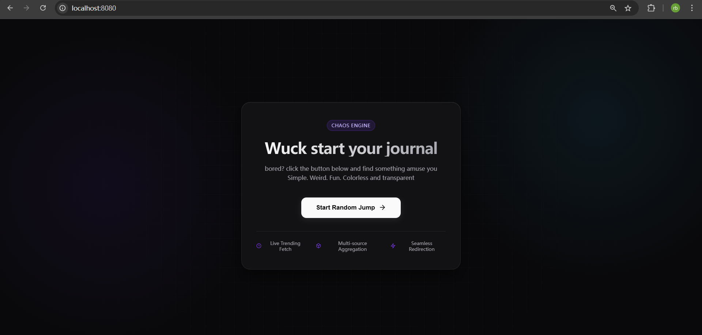
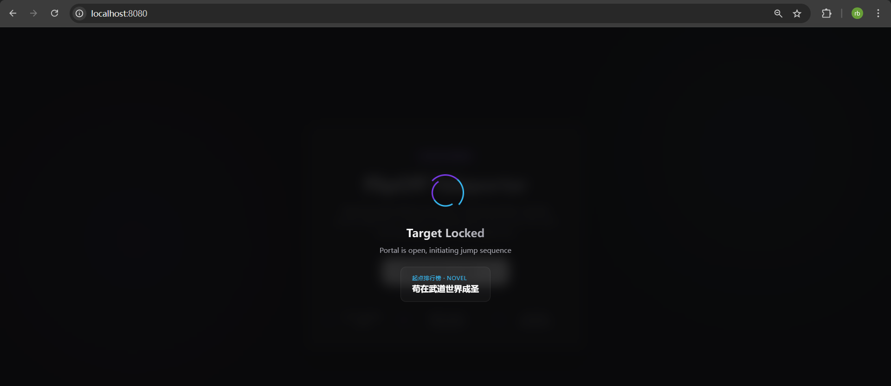

# MessFunny

bored? Open this site and let it throw you somewhere fresh.

Luangao is a free, open-source web app that exposes a single endpoint and turns one click into a random jump across live trending content. It fetches hot links from selected websites, picks one at random, then sends you there with a flashy loading screen and a tiny bit of chaos.

Simple. Weird. Fun.




## What is this?

Luangao is a lightweight Go web app built around one idea: press a button, get sent somewhere interesting.

The frontend only calls one API: `GET /api/biu`.

The backend fetches live trending content from multiple sources, merges and deduplicates the results, randomly selects one item, and returns it to the browser. The page then plays a short loading sequence and redirects you automatically.

No accounts. No admin setup. No content management panel. Just run it and start jumping.

## Features

- Single-endpoint design focused on `GET /api/biu`
- Built-in landing page with animated UI and loading overlay
- Live trending-content fetching instead of hardcoded destination links
- Mixed content categories including novels, videos, blogs, and news
- Random source selection and random result selection
- In-memory caching and URL deduplication
- Lightweight Go backend with no frontend build step
- Pure server-rendered HTML, CSS, and JavaScript

## Current Sources

Luangao currently fetches trending content from:

- Qidian ranking pages
- Bilibili popular videos
- CNBlogs top recommended posts
- Hacker News top stories

The app does not store a fixed list of target URLs. It fetches live hot content from these sources and returns a random result.

## Quick Start
😐 _uck， no patition to run local, 【quick quick quick start: 】vist https://wuck.onrender.com, and wait for about 15min to hot start the website(I have no money to buy a single machine to deploy so just use this haha)
### Requirements

- Go 1.22 or newer

### Clone the repo

```bash
git clone https://github.com/Tansuozhe1num/wuck.git
cd luangao
```

### Run the app

```bash
go run .
```

Then open:

```text
http://localhost:8080
```

### Run on a custom port

Linux / macOS:

```bash
PORT=8090 go run .
```

Windows PowerShell:

```powershell
$env:PORT="8090"
go run .
```

## API

### `GET /api/biu`

This endpoint:

- fetches trending content from multiple sources
- merges and deduplicates results
- returns one random jump target

Example response:

```json
{
  "code": 0,
  "msg": "ok",
  "data": {
    "title": "Britain today generating 90%+ of electricity from renewables",
    "url": "https://grid.iamkate.com/",
    "category": "news",
    "hint": "This result came from the Hacker News hot list.",
    "source": "Hacker News",
    "fetchedAt": "2026-03-28T20:31:32+08:00"
  }
}
```

## How It Works

1. The user opens the homepage and clicks the main button.
2. The frontend sends a request to `GET /api/biu`.
3. The backend randomly chooses several content sources.
4. It fetches ranking pages or public APIs from those sites.
5. The results are merged and deduplicated by URL.
6. The final result set is cached in memory.
7. One random target is selected and returned to the browser.
8. The frontend shows a short transition animation and redirects automatically.

## Development

Run the usual checks:

```bash
go test ./...
go vet ./...
go build ./...
```

## File Structure

```text
luangao/
  biu/                  response helpers
  controller/fun/       HTTP controller layer
  handler/fun/          crawler logic, caching, source definitions
  server/httpserver/    router and built-in frontend page
  Agent.md              original project note that survived
  README.md
  go.mod
  go.sum
  main.go
```

## Customization

You can customize Luangao by editing the source list and behavior:

- Add or remove ranking sources in the crawler source setup
- Adjust cache duration
- Change the homepage copy and visual style
- Add more categories such as images, forums, or niche communities
- Replace the loading sound and animation style

## Notes

- This project depends on external ranking pages and public endpoints, so some sources may break if a site changes its HTML, API rules, anti-bot policy, or regional availability
- Caching is currently in-process memory only, so restarting the service clears the cache
- If one source fails, the system will still try to return content from other available sources
- This is a playful side project, not a production-grade crawling platform
- If you want to run it long-term, consider adding Redis, retries, timeouts, circuit breaking, and configurable source rules

